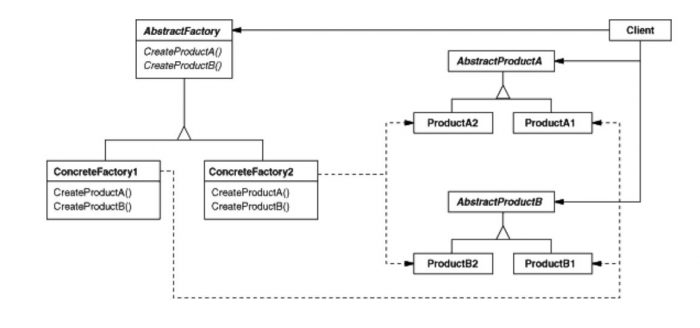

## Abstract Factory

Lets you produce families of related objects without specifying their concrete classes.

### Diagram

### When to use it
* When your code needs to work with various families of related products, but you don’t want it to depend on the concrete classes of those products.

### Resources
* https://refactoring.guru/design-patterns/abstract-factory
