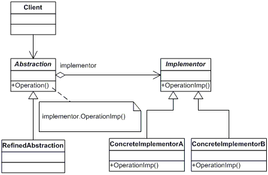

## Bridge

Lets you split a large class or a set of closely related classes into two separate hierarchies—abstraction and implementation—which can be developed independently of each other.

### Diagram

### When to use it
* When you want to divide and organize a monolithic class that has several variants of some functionality.
* When you need to extend a class in several orthogonal (independent) dimensions.
* If you need to be able to switch implementations at runtime.

### Resources
* https://refactoring.guru/design-patterns/bridge
