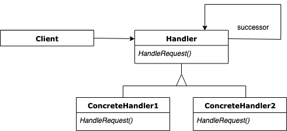

## Chain of Responsibility

Lets you pass requests along a chain of handlers. Upon receiving a request, each handler decides either to process the request or to pass it to the next handler in the chain.

### Diagram

### Resources
* https://refactoring.guru/design-patterns/chain-of-responsibility
