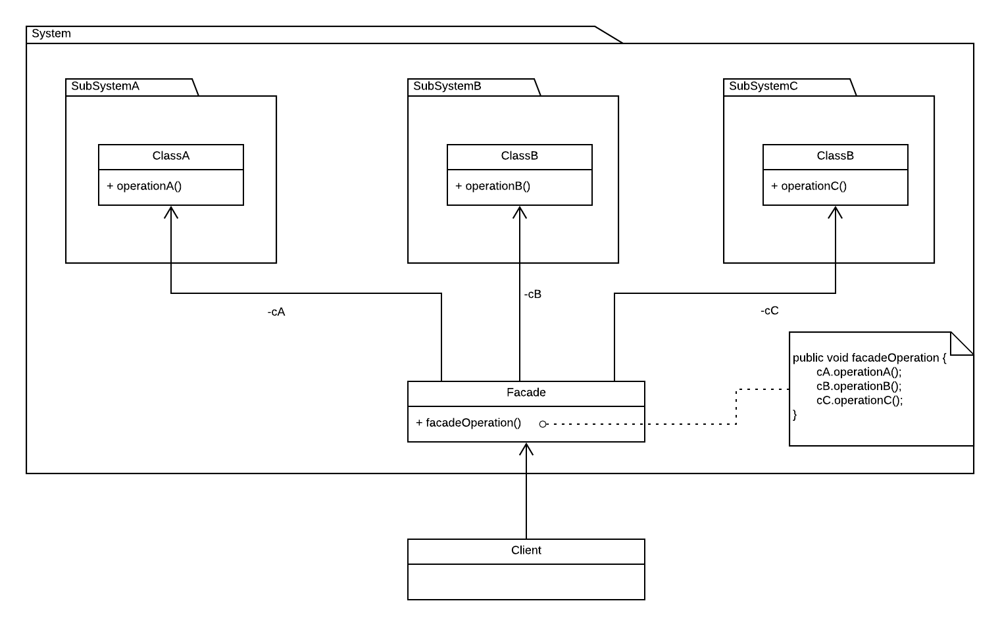

## Facade

 Provides a simplified interface to a library, a framework, or any other complex set of classes.

### Diagram

### When to use it
* When you need to have a limited but straightforward interface to a complex subsystem.
* When you want to structure a subsystem into layers.

### Resources
* https://refactoring.guru/design-patterns/facade
