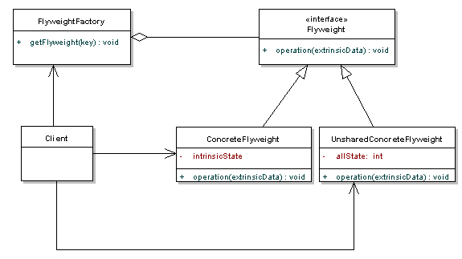

## Flyweight

Lets you fit more objects into the available amount of RAM by sharing common parts of state between multiple objects instead of keeping all of the data in each object.

### Diagram

### When to use it
* When your program must support a huge number of objects which barely fit into available RAM.

### Resources
* https://refactoring.guru/design-patterns/flyweight
