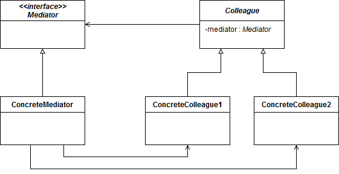

## Mediator 

Lets you reduce chaotic dependencies between objects. The pattern restricts direct communications between the objects and forces them to collaborate only via a mediator object.

### Diagram

### When to use it
* When it’s hard to change some of the classes because they are tightly coupled to a bunch of other classes.
* When you can’t reuse a component in a different program because it’s too dependent on other components.
* When you find yourself creating tons of component subclasses just to reuse some basic behavior in various contexts.

### Resources
* https://refactoring.guru/design-patterns/mediator
