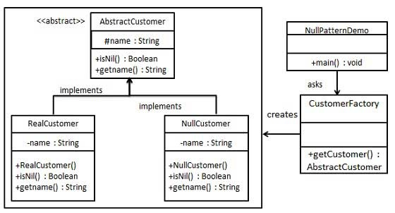

## Null Object 

A null object replaces check of NULL object instance. Instead of putting if check for a null value, Null Object reflects a do nothing relationship. Such Null object can also be used to provide default behaviour in case data is not available.

### Diagram

### When to use it
* When you have many checks for null in your code, making it longer and uglier.

### Resources
* https://www.tutorialspoint.com/design_pattern/null_object_pattern.htm#:~:text=In%20Null%20Object%20pattern%2C%20a,case%20data%20is%20not%20available.
* https://app.pluralsight.com/library/courses/csharp-design-patterns-null-object/table-of-contents