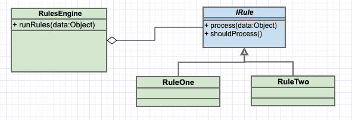

## Rules Engine

Lets you split up conditional logic into explicit rule classes.

### Diagram

### When to use it
* When you need to split up conditional logic into explicit rule classes.

### Resources
* https://app.pluralsight.com/library/courses/c-sharp-design-patterns-rules-pattern
