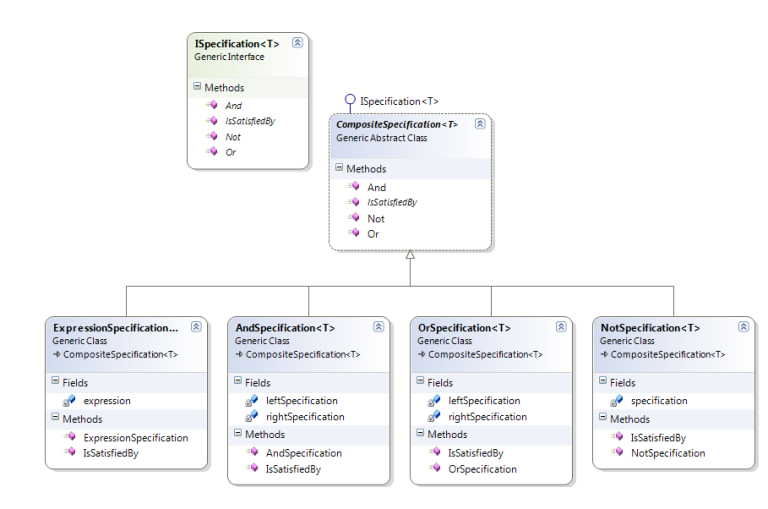

## Specification 

Business rules can be recombined by chaining the business rules together using boolean logic. The pattern is frequently used in the context of domain-driven design.

### Diagram

### Resources
* https://codingsight.com/specification-design-pattern-in-c/
* https://www.codeproject.com/Articles/670115/Specification-pattern-in-Csharp
