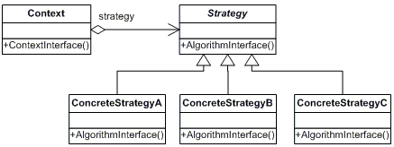

## Strategy

Lets you define a family of algorithms, put each of them into a separate class, and make their objects interchangeable.

### Diagram

### Resources
* https://refactoring.guru/design-patterns/strategy
