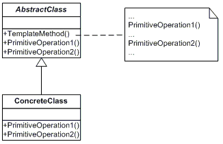

## Template Method

Defines the skeleton of an algorithm in the superclass but lets subclasses override specific steps of the algorithm without changing its structure.

### Diagram

### Resources
* https://refactoring.guru/design-patterns/template-method
